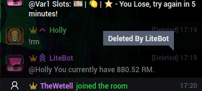

Show Deleted Messages
=====================

ExtPlug plugin that keeps showing deleted chat messages.



It also tells you which moderator deleted the message when you hover the
`[Deleted]` tag.

## Installation

You can install this plugin by going to your ExtPlug settings menu, pressing
"Install Plugin", and entering this Plugin URL:

```
https://unpkg.com/extplug-show-deleted
```

## Room Settings

**Note: This section is intended for room hosts only.**

Deleted chat messages are styled with the ".cm.extplug-deleted" class. Use this class if you
wish to style messages specially in your Room Style.

```json
{
  "css": {
    "rule": {
      ".cm.extplug-deleted": {
        "background-color": "red"
      }
    }
  }
}
```

## Building

**Note: this section is intended for developers only.**

First, install dependencies:

```bash
npm install
```

Then, use:

```bash
npm run build
```

The plugin will be built using the [ExtPlug CLI](https://github.com/extplug/extplug-cli).

The built plugin will be stored at `build/show-deleted.js`.

## License

[MIT](./LICENSE)
